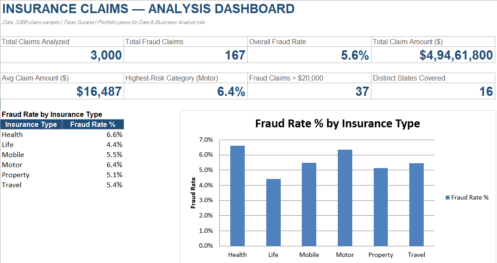
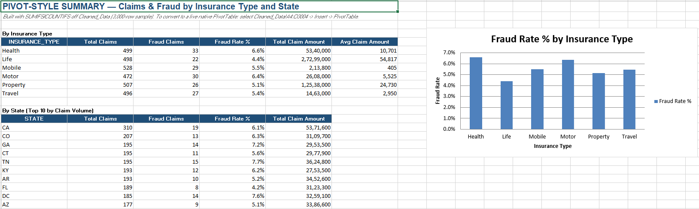

# Insurance Claim Fraud Detection — Machine Learning, SQL & Excel

> An end-to-end insurance claim fraud analysis project using Python, Machine Learning, SQL and Excel to identify potential fraud patterns, analyze risk factors and generate actionable business insights.

## 📌 Project Overview

Insurance fraud can result in significant financial losses and increase claim-processing costs. Manual claim verification can also be time-consuming and may fail to identify complex fraud patterns.

This project develops an end-to-end analytical approach for identifying potentially fraudulent insurance claims. The project combines Python and Machine Learning for fraud classification, SQL for structured data analysis, and Excel for supporting analysis, Pivot-based reporting and dashboard visualization.

The analysis integrates insurance claim, employee/agent and vendor information to identify potential fraud-related patterns and support risk prioritization.

## 🔄 Project Workflow

Data Integration
       ↓
Data Cleaning & Preprocessing
       ↓
Exploratory Data Analysis (EDA)
       ↓
SQL-Based Data Analysis
       ↓
Excel Analysis & Dashboard
       ↓
Fraud Target Creation
       ↓
Feature Engineering & Selection
       ↓
Class Imbalance Analysis
       ↓
Machine Learning Classification
       ↓
Model Evaluation
       ↓
Feature Importance Analysis
       ↓
Business Recommendations

---

## 📊 Dataset

The project uses three datasets:

| Dataset | Records | Columns |
|---|---:|---:|
| Insurance Data | 10,000 | 38 |
| Employee Data | 1,200 | 10 |
| Vendor Data | 600 | 7 |

The datasets were integrated to combine customer, employee/agent, and vendor information for fraud analysis.

After integration, the combined dataset contained **10,000 records and 53 columns**.

### Excel Analysis Sample

The Excel analysis workbook uses a 3,000-record sample from the same 10,000-record integrated dataset. The sample was used to demonstrate data cleaning, Pivot-based analysis, lookup functions and dashboard reporting in Excel.

### Target Variable

The `CLAIM_STATUS` variable was mapped to create the binary `Fraud` target:

| Value | Meaning |
|---:|---|
| `0` | Genuine Claim |
| `1` | Fraudulent Claim |

### Class Distribution

- **Genuine Claims:** 9,497
- **Fraudulent Claims:** 503
- **Fraud Rate:** 5.03%

The dataset therefore contains a significant class imbalance, which is an important consideration when evaluating fraud-detection models.

---

## 🎯 Project Objectives

1. Understand the insurance claim data
2. Integrate insurance, employee, and vendor information
3. Clean and preprocess the datasets
4. Perform exploratory data analysis
5. Identify potential fraud-related patterns
6. Prepare relevant features for Machine Learning
7. Analyze class imbalance
8. Train multiple classification models
9. Compare model performance
10. Identify important fraud-related factors
11. Generate actionable business recommendations

---

## 🔎 Exploratory Data Analysis

The project includes **18 visualizations** covering:

- Customer age distribution
- Marital status
- Employment status
- Education level
- Social class
- Insurance type
- Claim amount distribution
- Premium amount distribution
- Claim status distribution
- Fraud by age
- Fraud by insurance type
- Fraud by incident severity
- Fraud by injury information
- Fraud by police report availability
- Fraud by incident hour
- Correlation analysis
- Claims by state
- Risk segmentation

### Key EDA Insights

- Most policyholders fall within the 30–60 age range.
- Married customers represent the dominant customer segment.
- Auto and Health insurance account for a large share of claims.
- Most claims are relatively small, with a smaller number of high-value claims.
- Major incident severity shows higher fraud likelihood.
- Some insurance categories show higher fraud frequency.
- Missing police reports are associated with suspicious claim patterns.
- Late-night incidents show higher fraud concentration.
- High-risk segments show increased denial rates.

---

## 🔍 SQL Analysis

SQL was used to perform structured analysis of the insurance claims data and investigate potential fraud-related patterns.

### Analysis Performed

- Claim volume and fraud-rate analysis
- Fraud analysis by insurance type
- Claim amount and severity analysis
- Agent-level fraud analysis
- Vendor-level fraud analysis
- Identification of high-risk agents based on fraud rates
- Analysis of claims above average claim amounts
- State-level claim ranking
- Incident severity analysis

### SQL Concepts Demonstrated

- SELECT and filtering
- GROUP BY and HAVING
- CASE WHEN
- Aggregate functions
- INNER JOIN
- LEFT JOIN
- Subqueries
- Common Table Expressions (CTEs)
- Window functions
- Ranking and fraud-rate calculations

📄 **SQL File:** `SQL/Fraud_Claims_SQL_Portfolio_Queries.sql`

---

## 📊 Excel Analysis & Dashboard

Excel was used for supporting data analysis, structured reporting and dashboard visualization.

### Excel Analysis Includes

- Raw claims data
- Cleaned claims data
- Pivot-based analysis
- Fraud-rate calculations
- Insurance-type analysis
- Lookup examples using INDEX/MATCH
- Agent and vendor reference data
- Summary KPI dashboard

The workbook uses a 3,000-record sample from the overall 10,000-record integrated dataset.

📊 **Excel Workbook:** `Excel/Insurance_Claim_Fraud_Excel_Analysis.xlsx`

### Excel Dashboard



### Pivot Analysis



---

## 🧹 Data Preprocessing

The preprocessing workflow included:

- Handling missing values
- Removing unnecessary identifiers and personal information
- Encoding categorical variables
- Feature selection
- Preparing the target variable
- Train-test splitting
- Stratified sampling to preserve class distribution

---

## 🤖 Machine Learning Models

Four classification algorithms were trained and compared:

1. Logistic Regression
2. Decision Tree
3. Random Forest
4. Gradient Boosting

---

## 📈 Model Performance

| Model | Accuracy |
|---|---:|
| Logistic Regression | **94.95%** |
| Random Forest | **94.95%** |
| Gradient Boosting | **94.80%** |
| Decision Tree | **88.80%** |

**Logistic Regression and Random Forest achieved the highest reported accuracy of 94.95%.**

> **Evaluation note:** Because the dataset is imbalanced, accuracy alone should not be treated as the only measure of fraud-detection performance. Precision, recall, F1-score, ROC-AUC, and confusion-matrix analysis are important for a more complete evaluation.

---

## 🔑 Important Fraud-Related Factors

Feature analysis highlighted several factors associated with fraudulent claims:

- Claim Amount
- Incident Severity
- Risk Segmentation
- Premium Amount
- Incident Hour
- Police Report Availability
- Injury Information

These factors can help prioritize claims for additional investigation.

---

## 💼 Business Recommendations

### 1. Automatically Flag High Claim Amounts

Claims with unusually high claim amounts can be automatically flagged for additional verification.

### 2. Increase Verification for High-Risk Segments

High-risk customer segments can receive additional verification before claim approval.

### 3. Investigate Claims Without Police Reports

Claims without available police reports can be prioritized for further investigation.

### 4. Monitor Repeat Vendors and Agents

Vendor and agent behavior can be monitored to identify recurring suspicious patterns.

### 5. Introduce ML-Based Fraud Screening

A fraud-screening model can be incorporated into the claim-processing workflow to identify potentially suspicious claims before approval.

---

## 🛠️ Technology Stack

| Category | Tools |
|---|---|
| Programming | Python |
| Data Analysis | Pandas, NumPy |
| Machine Learning | Scikit-learn |
| Visualization | Matplotlib, Seaborn |
| SQL | SQL |
| Spreadsheet Analysis | Microsoft Excel |
| Environment | Jupyter Notebook |

---

## 🔄 Project Workflow

```text
Data Integration
       ↓
Data Cleaning & Preprocessing
       ↓
Exploratory Data Analysis
       ↓
Fraud Target Creation
       ↓
Class Imbalance Analysis
       ↓
Feature Preparation
       ↓
Train-Test Split
       ↓
Machine Learning Models
       ↓
Model Evaluation
       ↓
Feature Importance
       ↓
Business Recommendations
```

---

## 📁 Repository Contents

```text
Insurance-Claim-Fraud-Detection-ML/
│
├── .gitignore
├── README.md
│
├── Insurance_Claim_Fraud_Detection_using_Machine_Learning.ipynb
│
├── SQL/
│   └── Fraud_Claims_SQL_Portfolio_Queries.sql
│
├── Excel/
│   └── Insurance_Claim_Fraud_Excel_Analysis.xlsx
│
└── Images/
    ├── excel_dashboard.png
    └── excel_pivot_analysis.png
```

Python Notebook: Complete data preprocessing, EDA, visualization, machine learning modeling and evaluation.
SQL File: Structured SQL queries for insurance claim and fraud analysis.
Excel Workbook: Data cleaning, Pivot-based analysis, lookup examples and summary dashboard.
Images: Screenshots of the Excel dashboard and analytical outputs.

---

## ⚠️ Project Limitations

- The dataset contains a relatively small proportion of fraudulent claims, creating class imbalance.
- Accuracy alone does not fully capture fraud-detection effectiveness.
- The model is intended as an analytical and screening approach rather than a production-ready fraud decision system.
- Further validation on real-world and unseen insurance data would be required before deployment.

---

## ✅ Conclusion

This project developed an end-to-end analytical approach to insurance claim fraud detection by combining Python, Machine Learning, SQL and Excel.

The project integrated insurance claim, employee/agent and vendor information, performed exploratory analysis and identified important fraud-related patterns. SQL was used for structured claim, fraud-rate, agent and vendor analysis, while Excel provided supporting data analysis, Pivot-based reporting and dashboard visualization.

Four Machine Learning classification algorithms were trained and compared, with Logistic Regression and Random Forest achieving the highest reported accuracy of 94.95%.

The project demonstrates how data analytics, SQL, Excel and Machine Learning can work together to support fraud screening, risk prioritization, claim investigation and data-driven decision-making.

---

## 📂 Project Resources

- [Machine Learning Notebook](Insurance_Claim_Fraud_Detection_using_Machine_Learning.ipynb)
- [SQL Fraud Analysis](SQL/Fraud_Claims_SQL_Portfolio_Queries.sql)
- [Excel Analysis & Dashboard](Excel/Insurance_Claim_Fraud_Excel_Analysis.xlsx)
